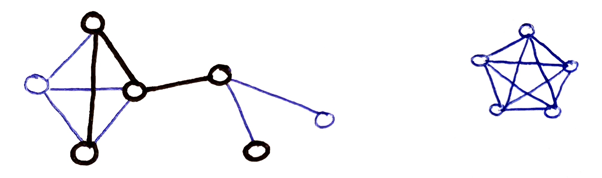
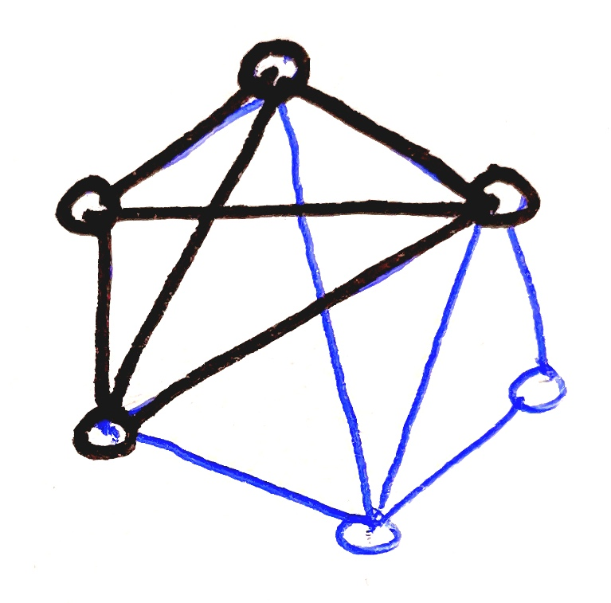
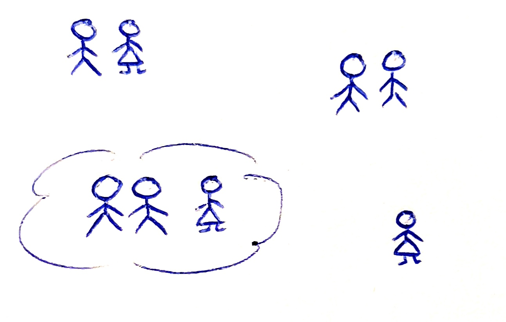

---
false
marp: true

theme: lemon


---

# **PROBLEM NAJVEČJIH KLIK**

**Avtor:** Tamara Eissa

**Datum:** 22. 4. 2022

---


## Problem

Dan je neusmerjen graf z `V` vozlišči in `P` povezavami. Želimo najti največje (ang. maximal) klike v danem grafu.


---

## Definicije

1. **Klika:** Klika je poln podgraf danega grafa.
2. **Podgraf** 
3. **Poln graf**




## Predpostavke:

* prazen graf je klika poljubnega grafa,
* poljubna točka danega grafa je klika tega grafa.


---

## Kaj je največja klika?

Največja klika je klika. Pojem "največja" pa ima dva pomena, ki izvirata iz angleščine.

* Klika je največja (ang. maximum), kadar *vsebuje največje število vozlišč*.
* Klika je največja (ang. maximal) natanko tedaj, ko *ni podgraf druge klike*.




---

## Motivacija

socialno omrežje:




---


## Kako se lotimo problema?

### Podatki:
* seznam vseh vozlišč danega grafa,
* pripadajoča tabela sosednosti.
 
### Osnove postopka:
* poljubno vozlišče je vsebovano v maksimalni kliki ali pa ne;
* zaporedje izbire vozlišč tekom postopka ni relevantno.

### Izhod algoritma:

* Seznam vozlišč, ki tvorijo maksimalno kliko danega grafa.


---

## Bron-Kerboschov algoritem

* rekurzivno sestopanje,
* trije disjunktni nabori vozlišč: `R`, `P` in `X`.
* Vemo, da klika vsebuje:
  *  *vsa vozlišča* iz `R`,
  *  *nekatera* iz `P`,
  *  *nobenega* iz `X`.
* Ob inicializaciji:
  * `R` in `X` prazni,
  * `P` vsebuje vsa vozlišča danega grafa.
* na vsakem koraku algoritma:
  * unija `P` in `X` vsebuje izključno vozlišča, ki so povezana z nekaterimi vozlišči iz `R`.


---

### Postopek preverjanja vozlišč

Preverimo vsa vozlišča iz množice `P`:

* hkrati sta prazni množici `P` in `X` => h kliki `R` ne moremo dodati novega vozlišča => algoritem na tem mestu vrne množico `R`;
* posamezno vozlišče `v` iz `P` rekurzivno doda v `R`;
   * množici `P` in `X` vsebujeta le vozlišča iz posamezne množice, ki so sosednja vozlišču `v`. S tem pridobimo vse klike, ki vsebujejo vozlišča iz `R` (skupaj z vozliščem `v`);
   * ob koncu rekurzivnega klica: `v` prestavi iz `P` v `X`. S tem lahko v nadaljevanju pridobimo še klike, ki ne vsebujejo vozlišča `v`.

Ta algoritem poišče le netrivialne klike, torej klike, ki vsebujejo najmanj dve vozlišči.


---

## Primer implementacije v Pythonu:

```python
def Bron_Kerbosch(R, P, X, sl_vozlisc, samo_najvecje=False):
    '''
        Algoritem vrne seznam vseh maksimalnih klik danega omrežja.

        Vhodni podtki:
            R ... množica, katere vsi elementi so vsebovani v kliki;
            P ... množica, katere nekateri elementi so vsebovani v kliki;
            X ... množica, katere noben element ni vsebovan v kliki;
            sl_vozlisc ... slovar vozlišč danega omrežja, katerega elementi so oblike
                `id_vozlišča: vozlišče`, pri čemer je `vozlišče` oblike `Vozlisce(id, sosedi, ime, vsebina, st_sosedov)`
    '''
    st_vozlisc_v_najvecji_kliki = 0
    seznam_klik = list()
    if not P and not X:  # `P` in `X` sta prazni
        # k `R` ne moremo dodati novega vozlišča
        # torej `R` zagotovo vsebuje maksimalno kliko danega grafa
        if R and (R not in seznam_klik):
            st_vozlisc_v_najvecji_kliki, seznam_klik = posodobi_seznam_maksimalnih_klik(R, seznam_klik, st_vozlisc_v_najvecji_kliki, samo_najvecje)
    
    else:
        for v in P:
            sosedi_v = set(sl_vozlisc[v].sosedi)

            R_copy = R.copy() 
            R_copy.add(v)
            P_copy = P.copy()
            P_copy = sosedi_v.intersection(P)
            X_copy = X.copy()
            X_copy = sosedi_v.intersection(X)

            # rekrzivno dodamo klike v seznam klik
            for klika in Bron_Kerbosch(R_copy, P_copy, X_copy, sl_vozlisc, samo_najvecje):
                if klika and (klika not in seznam_klik):
                    st_vozlisc_v_najvecji_kliki, seznam_klik = posodobi_seznam_maksimalnih_klik(klika, seznam_klik, st_vozlisc_v_najvecji_kliki, samo_najvecje)
            
            P = P.difference({v})
            X.add(v)

    return seznam_klik


def posodobi_seznam_maksimalnih_klik(klika, sez_klik, st_vozlisc_v_najvecji_kliki, samo_najvecje=False):
    '''
        Vrne število vozlišč v največji kliki izmed do sedaj odkritih klik in seznam klik.

        Vhodni podatki:
            klika ... klika, ki jo želimo dodati v seznam klik
            sez_klik ... do sedaj ustvarjeni seznam "maksimalnih" klik
            st_vozlisc_v_najvecji_kliki ... število vozlišč v trenutno največji kliki
    '''
    if samo_najvecje:
        st_eltov_v_kliki = len(klika)
        if st_eltov_v_kliki == st_vozlisc_v_najvecji_kliki:  # še ena klika, ki je potencialno največja
            sez_klik.append(klika)
        elif st_eltov_v_kliki > st_vozlisc_v_najvecji_kliki:  # trenutna klika je do sedaj največja odkrita
            sez_klik = [klika]
            st_vozlisc_v_najvecji_kliki = st_eltov_v_kliki
    else:  # vse maksimalne klike - ne samo največje glede na število vsebovanih vozlišč
        sez_klik.append(klika)
    return st_vozlisc_v_najvecji_kliki, sez_klik
```


---

## Časovna in prostorska zahtevnost Bron-Kerboschovega algoritma

Recimo, da je `e` število povezav, `v` število vozlišč in `s` količina prostora, potrebnega za shranjevanje enega vozlišča danega omrežja.


---

#### Najboljša možna časovna zahtevnost:

Dano omrežje ne vsebuje vozlišč => `O(1)`.


---

#### Najslabša možna časovna zahtevnost:

* Vedno pregleda vsa vozlišča danega omrežja => `O(v)`.
* Za vsako vozlišče preveri, ali je vsebovano v maksimalni kliki ali ne.
* Za vsako vozlišče omrežja opravi rekurzivni klic:
   * inicializacija algoritma: `Bron_Kerbosch(set(), množica_vseh_vozlišč_danega_omrežja, set(), sl_vozlisc)`,
   * ob obravnavi prvega vozlišča omrežja se kliče: `Bron_Kerbosch(set(izbrano_vozlišče), množica_vseh_vozlišč_danega_omrežja.difference(izbrano_vozlišče), set(), sl_vozlisc)`.
* Zgodi se `v` rekurzivnih klicov:
   * na `i`-tem koraku rekurzije je `|P| = v - i - 1` => na vsakem koraku rekurzije `O(v - i - 1)` operacij.
* S pomočjo metode ostrega pogleda ugotovimo: `O(v) * O(v - 1) * O(v - 2) * ... O(1) * O(0) = O(v!)`.


---

### Najboljša možna prostorska zahtevnost:

Dano omrežje ne vsebuje vozlišč => `O(1)`.


---

### Najslabša možna prostorska zahtevnost:

* množice `P`, `R` in `X` skupaj vsebujejo natanko vsa vozlišča => `O(2 * v)` prostora (original + kopija);
* tabela sosednosti => `O(v + 2 * e)` (vozlišče + 2x povezava);
* slovar vozlišč (v odvisnosti od količine podatkov shranjenih v vozliščih) => `O(e + v * s)`;
* prostor, potreben za shranjevanje rezultata: algoritem deluje na podlagi rekurzije in pri tem generira največ `3 ^ (v / 3)` največjih klik [1] => `O(e + v * s) + O(2 ^ (v / 3)) = O(2 ^ (v / 3))`.


---

## Viri:

[1] *Bron–Kerbosch algorithm*, November 12, 2021. [Online], Avalible: https://en.wikipedia.org/wiki/Bron%E2%80%93Kerbosch_algorithm [Accessed Februar 12, 2022]